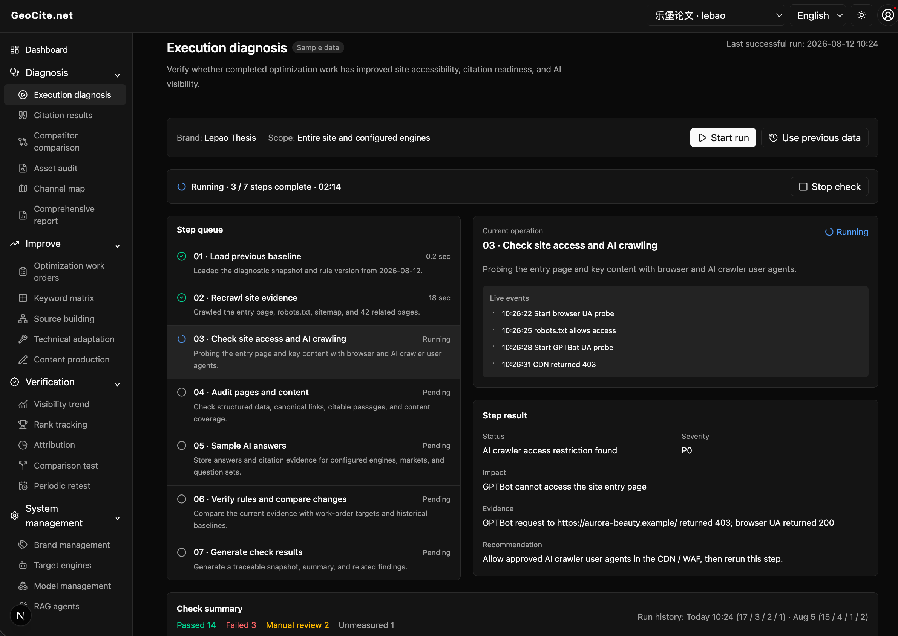

# [GeoCite.net](https://geocite.net)

> A Generative Engine Optimization (GEO) platform for AI search engines—measuring, explaining, optimizing, and reporting how brands appear in AI-generated answers.

[中文文档](README.zh-CN.md)

## Execution diagnosis

Execution diagnosis verifies whether completed GEO optimization work has taken effect. Its seven-step queue presents check progress, while each step exposes live events, conclusions, evidence, and remediation guidance.

## License

GeoCite is licensed under the [GeoCite.net License v1.1](LICENSE.md), a source-available license based on Apache 2.0 with additional commercial restrictions.

For commercial licensing, contact [license@geocite.net](mailto:license@geocite.net).
