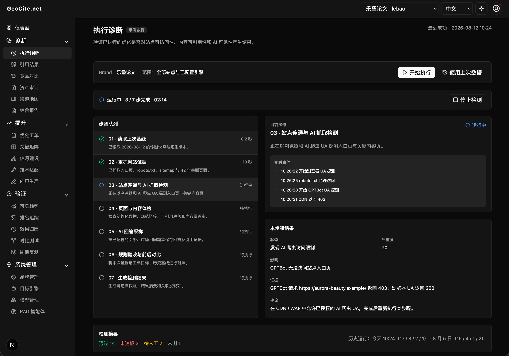

# [GeoCite.net](https://geocite.net) 

> 面向 AI 搜索引擎的生成式引擎优化（GEO）平台，帮助品牌衡量、理解、优化并汇报其在 AI 生成回答中的表现。

[English README](README.md)

## 执行诊断

执行诊断用于验证已执行的 GEO 优化是否真实生效。页面以七步队列展示检测进度，并提供每一步的实时事件、检查结论、证据与修复建议。

## 许可证

GeoCite 使用 [GeoCite.net License v1.1](LICENSE.md)。该许可证基于 Apache 2.0，并附加商业使用限制，属于源码可用许可证。

商业许可请联系：[license@geocite.net](mailto:license@geocite.net)。
